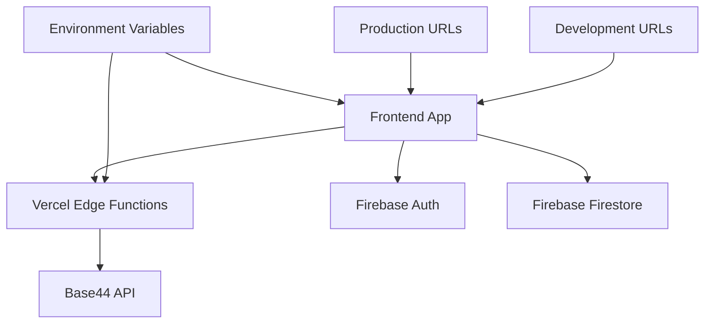

# Design Document

## Overview

This design addresses the deployment readiness of the Player Portal application for Vercel, focusing on API routing, environment configuration, and production URL handling. The solution ensures all functionality works seamlessly in both development and production environments.

## Architecture

### Current State Analysis

The application currently has:
- Vite-based React frontend with proper build configuration
- Firebase authentication and Firestore integration
- Base44 API client expecting proxy endpoints
- Hardcoded localhost URLs for cross-app navigation
- Mock data fallbacks for development

### Target Architecture



## Components and Interfaces

### 1. Vercel API Routes

**Location:** `/api/base44.js`
- **Purpose:** Proxy requests to Base44 API
- **Method:** POST with request body containing method, path, query, and body
- **Response:** JSON data from Base44 API or error messages

### 2. Environment Configuration

**Production Environment Variables:**
- `VITE_FIREBASE_API_KEY`
- `VITE_FIREBASE_AUTH_DOMAIN`
- `VITE_FIREBASE_PROJECT_ID`
- `VITE_FIREBASE_STORAGE_BUCKET`
- `VITE_FIREBASE_MESSAGING_SENDER_ID`
- `VITE_FIREBASE_APP_ID`
- `VITE_FIREBASE_MEASUREMENT_ID`
- `VITE_O7C_HUB_URL` (for cross-app navigation)

### 3. URL Configuration Service

**Purpose:** Manage environment-specific URLs
- Development: localhost URLs
- Production: actual domain URLs
- Fallback handling for missing configuration

### 4. Error Boundary Components

**Purpose:** Graceful error handling for API failures
- Network error handling
- Firebase configuration errors
- Missing API endpoint handling

## Data Models

### API Request Model
```typescript
interface ProxyRequest {
  method: 'GET' | 'POST' | 'PUT' | 'DELETE';
  path: string;
  query?: Record<string, string>;
  body?: any;
}
```

### Environment Config Model
```typescript
interface EnvironmentConfig {
  firebaseConfig: FirebaseConfig;
  apiUrls: {
    o7cHub: string;
    base44Proxy: string;
  };
  isDevelopment: boolean;
}
```

## Error Handling

### 1. API Error Handling
- Network timeouts with retry logic
- HTTP error status handling
- Graceful degradation for missing endpoints

### 2. Firebase Error Handling
- Missing configuration detection
- Authentication failure handling
- Firestore connection error handling

### 3. Navigation Error Handling
- Invalid URL detection
- Cross-origin navigation issues
- Fallback to current app if navigation fails

## Testing Strategy

### 1. Build Testing
- Verify Vercel build completes successfully
- Check all dependencies are properly bundled
- Validate environment variable usage

### 2. API Integration Testing
- Test Base44 proxy endpoint functionality
- Verify Firebase authentication works
- Check error handling for failed requests

### 3. Navigation Testing
- Test cross-app navigation in production
- Verify menu items are visible and functional
- Check role-based navigation differences

### 4. Environment Testing
- Test with production environment variables
- Verify development fallbacks work
- Check configuration validation

## Implementation Considerations

### 1. Vercel Configuration
- Ensure `vercel.json` is properly configured
- Set up environment variables in Vercel dashboard
- Configure build and output directories

### 2. Security
- Validate API requests in proxy endpoint
- Sanitize user inputs
- Implement proper CORS handling

### 3. Performance
- Minimize API proxy overhead
- Implement request caching where appropriate
- Optimize bundle size for faster loading

### 4. Monitoring
- Add logging for API requests
- Monitor error rates
- Track navigation success rates